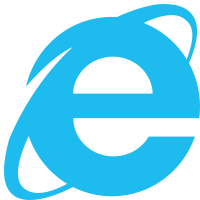

# assets

This document keeps track of all assets used in the game

## Images

The following table keeps track of all groups of images used as assets in the game. All images should fall into one of the groups,
respect their minimum and maximum boundaries, be transparent (`png`, `svg`) and shared under a free or attributed license.

|Group|Min Size|Max Size|
|----|--------|--------|
|`xs`|`24x24`|`48x48`|
|`s`|`56x56`|`96x96`|
|`m`|`144x144`|`196x196`|
|`xl`|`512x512`|`1280x1280`|

### Extra Small (xs)

All images labeled as extra small are described in the table below:

|Name|Size|Licence|Source|Image|
|----|----|-------|------|-----|
|Linux Mascot|`30x36`|lewing@isc.tamu.edu Larry Ewing|https://commons.wikimedia.org/wiki/File:Tux.png||
|Windows Mascot|`25x48`|Non-commercial Use|https://www.pngaaa.com/detail/393521||
|Apple Mascot|`30x30`|<a href="https://www.flaticon.com/free-icons/apple" title="apple icons">Apple icons created by Freepik - Flaticon</a>|https://www.flaticon.com/free-icon/apple_154870||
|Chrome Browser|`30x30`|<a href="https://www.flaticon.com/free-icons/google-chrome" title="google chrome icons">Google chrome icons created by Pixel perfect - Flaticon</a>|https://www.flaticon.com/free-icon/chrome_888846||
|Firefox|`32x32`|MPL 2|https://en.m.wikipedia.org/wiki/File:Firefox_logo,_2019.svg||
|Internet Explorer|`32x32`|NO LICENSE|https://en.m.wikipedia.org/wiki/File:Internet_Explorer_10%2B11_logo.svg||
|Motherboard Map|`30x30`|<a href="https://www.flaticon.com/free-icons/motherboard" title="motherboard icons">Motherboard icons created by pmicon - Flaticon</a>|https://www.flaticon.com/free-icon/motherboard_2009526||
|Cursor|`24x24`|<a href="https://www.flaticon.com/free-icons/pointer" title="pointer icons">Pointer icons created by Pixel perfect - Flaticon</a>|https://www.flaticon.com/free-icon/cursor_1828365||

### Small (s)

All images labeled as small are described in the table below:

|Name|Size|Licence|Source|Image|
|----|----|-------|------|-----|
|Cookie|`60x60`|Apache 2.0|https://www.iconarchive.com/show/noto-emoji-food-drink-icons-by-google/32420-cookie-icon.html||
|Youtube|`64x64`|<a href="https://www.flaticon.com/free-icons/youtube" title="youtube icons">Youtube icons created by Freepik - Flaticon</a>|https://www.flaticon.com/free-icon/youtube_1384060||
|Facebook|`64x64`|<a href="https://www.flaticon.com/free-icons/facebook" title="facebook icons">Facebook icons created by Freepik - Flaticon</a>|https://www.flaticon.com/free-icon/facebook_5968764||
|Instagram|`64x64`|<a href="https://www.flaticon.com/free-icons/instagram-logo" title="instagram logo icons">Instagram logo icons created by Freepik - Flaticon</a>|https://www.flaticon.com/free-icon/instagram_1409946||

### Medium (m)

All images labeled as medium are described in the table below:

|Name|Size|Licence|Source|Image|
|----|----|-------|------|-----|
|Linux Mascot|`149x180`|lewing@isc.tamu.edu Larry Ewing|https://commons.wikimedia.org/wiki/File:Tux.png||
|Windows Mascot|`103x196`|Non-commercial Use|https://www.pngaaa.com/detail/393521||
|Apple Mascot|`168x168`|<a href="https://www.flaticon.com/free-icons/apple" title="apple icons">Apple icons created by Freepik - Flaticon</a>|https://www.flaticon.com/free-icon/apple_154870||
|Chrome|`196x196`|<a href="https://www.flaticon.com/free-icons/google-chrome" title="google chrome icons">Google chrome icons created by Pixel perfect - Flaticon</a>|https://www.flaticon.com/free-icon/chrome_888846||
|Firefox|`160x160`|MPL 2|https://en.m.wikipedia.org/wiki/File:Firefox_logo,_2019.svg||
|Internet Explorer|`200x200`|NO LICENSE|https://en.m.wikipedia.org/wiki/File:Internet_Explorer_10%2B11_logo.svg||

### Extra Large (xl)

All images labeled as extra large are described in the table below:

|Name|Size|Licence|Source|Image|
|----|----|-------|------|-----|
|Motherboard Map|`512x512`|<a href="https://www.flaticon.com/free-icons/motherboard" title="motherboard icons">Motherboard icons created by pmicon - Flaticon</a>|https://www.flaticon.com/free-icon/motherboard_2009526||

## Sounds

The following table keeps track of all groups of sounds used as assets in the game. All sounds should fall into one of the groups and shared under a free or attributed license.

|Group|
|-----|
|`bgm`|
|`sfx`|

### BGM

All sounds labeled as background music are described in the table below:

|Name|Licence|Source|
|----|-------|------|
|Main Menu|[Music by Matthew Pablo](https://matthewpablo.com/services/)|https://opengameart.org/content/space-dimensions-8bitretro-version|
|Game|[Bart Kelsey](https://opengameart.org/users/bart)|https://opengameart.org/content/xeon-theme-remastered|

### SFX

All sounds labeled as sound effects are described in the table below:

|Name|Licence|Source|
|----|-------|------|
|Tab Clean|Creative Commons 0 (CC-0)|https://freesound.org/people/MATRIXXX_/sounds/495541/|
|Spawn|Creative Commons 0 (CC-0)|https://freesound.org/people/MATRIXXX_/sounds/523754/|
|Health Loss|NO LICENSE|https://www.myinstants.com/en/instant/roblox-oof/|
|Cookie Eat|[EminYILDIRIM Creative Commons 4 (CC-4)](https://freesound.org/people/EminYILDIRIM/)|https://freesound.org/people/EminYILDIRIM/sounds/554708/|
|Cookie Clean|Creative Commons 0 (CC-0)|https://freesound.org/people/MATRIXXX_/sounds/515736/|
|Electrical Shock|Creative Commons 0 (CC-0)|https://freesound.org/people/The-Sacha-Rush/sounds/657803/|
|Mouse Attack|[Digital Art by sketcherskt](https://opengameart.org/users/sketcherskt)|https://opengameart.org/content/pew-laser-fire-sound|
|Pause|Creative Commons 0 (CC-0)|https://opengameart.org/content/gui-sound-effects|
|Internet Explorer|[remaxim](https://opengameart.org/users/remaxim)|https://opengameart.org/content/bad-sound-2|
|Firefox|[InspectorJ Creative Commons 4 (CC-4)](https://freesound.org/people/InspectorJ/)|https://freesound.org/people/InspectorJ/sounds/485009/|
|Chrome|Creative Commons 0 (CC-0)|https://opengameart.org/content/growl|
|Windows|Microsoft|https://archive.org/details/windowsxpstartup_201910/Windows+XP+Startup.wav|
|Linux|Tux Paint|https://github.com/tux4kids/Tuxpaint-Android/blob/master/app/src/main/jni/tuxpaint/data/sounds/areyousure.wav|
|MacOS|Creative Commons 0 (CC-0)|https://opengameart.org/content/apple-bite|
|Click|[Some of the sounds in this project were created by ViRiX Dreamcore (David McKee)](https://soundcloud.com/virix)|https://opengameart.org/content/ui-and-item-sounds-sample-1|
|Hover|[Leohpaz Creative Commons 4 (CC-4)](https://opengameart.org/users/leohpaz)|https://opengameart.org/content/10-retro-rpg-menu-sounds|